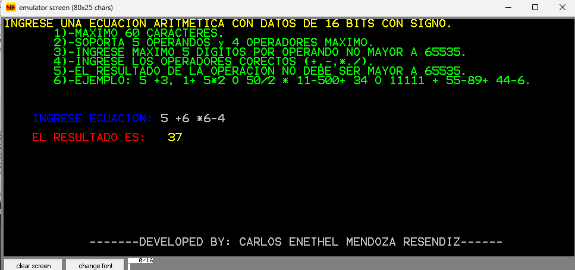
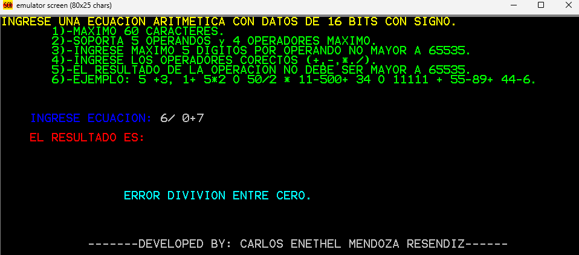
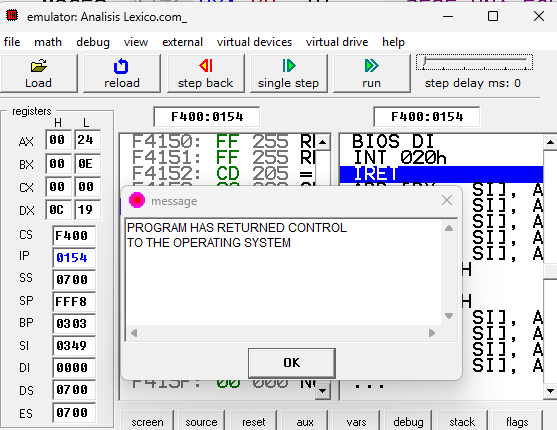

# Analisis-Lexico-en-ASM
Análisis Léxicos en ASM 

# Programa en Ensamblador: Evaluador de Expresiones Aritméticas

Este proyecto implementa un programa en lenguaje ensamblador que permite al usuario ingresar, a través del teclado, una cadena de texto representando una ecuación aritmética con operandos de **16 bits con signo**. El programa evalúa la expresión respetando la **jerarquía de operaciones** y muestra el resultado en pantalla.

---

## ✅ Funcionalidades implementadas

### 1. Entrada de datos
- El programa solicita al usuario una **única cadena de texto** que representa la ecuación.
- La cadena se almacena en un **arreglo de memoria** para su posterior análisis.
- La entrada está limitada a **operandos de un solo dígito**.

### 2. Operaciones aritméticas
- Soporta las **cuatro operaciones básicas**: suma (`+`), resta (`-`), multiplicación (`*`) y división (`/`).
- Evalúa las expresiones **respetando la precedencia de operadores**:
  - Multiplicación y división tienen prioridad sobre suma y resta.

### 3. Salida en pantalla
- Muestra instrucciones claras sobre cómo ingresar la ecuación.
- El resultado se muestra en formato **con signo de 16 bits**.

### 4. Control de pila y finalización
- El registro **SP (Stack Pointer)** debe tener el valor `FFF8h` al finalizar, indicando que las rutinas se gestionaron correctamente.
- Se manejan errores como **división por cero** o **entradas inválidas**.

---

## 💻 Ejemplo de ejecución

```plaintext
Ingrese una ecuación aritmética con datos de 16 bits con signo (máximo 60 caracteres):
5+3*2-8/4

```
El resultado es: 9

## 🖼️ Capturas de pantalla del programa

### 🔹 Evaluación de operaciones aritméticas


---

### 🔹 Manejo de división entre cero


---

### 🔹 Finalización correcta del programa

